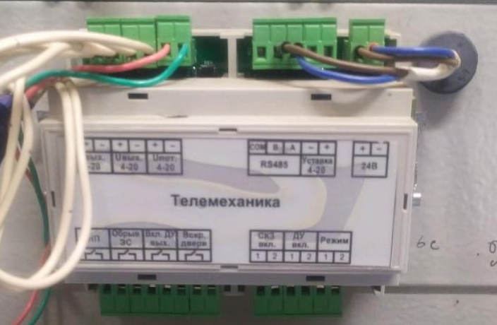



---

*  

   {width=704px height=460px}

*  

   **Подключение**

   Для подключения СКЗ к системам телеметрии через токовую петлю используется штатный блок ввода-вывода

---

*  

   {width=642px height=585px}

*  

   СКЗ серии ПКЗ-АР-Е2 Могут быть оснащены встроенным GSM модемом. Более широкий модуль модема для блока управления БУ-028, может быть с тумблером или без (с двумя светодиодами) Более широкий модуль модема, может быть с тумблером или без (с двумя светодиодами).

---

*  

   {width=350px height=356px}

*  

   Узкий модуль модема для блока управления БУ-026

   Имеет один светодиод, при этом для исполнения с ЖК экраном модуль измерения не устанавливается, вместо него установлена заглушка.


