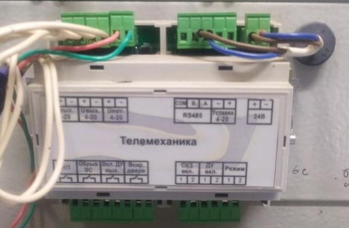
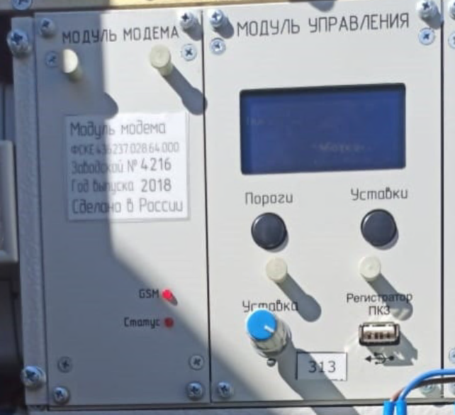

[image:./skz-serii-pkz-ar-4.png:::0,0,100,100:30::413px:683px:left]

[tabs]

[tab:Описание]

Преобразователь для катодной защиты ПКЗ-АР® выполнен в виде набора модулей и имеет ряд исполнений по максимальной выходной мощности.

Суммарная выходная мощность ПКЗ-АР® определяется общим числом составляющих его модулей. Значение суммарного выходного тока ПКЗ-АР® также определяется общим числом составляющих его модулей.

Силовые модули БМ имеют ряд типовых исполнений по выходной мощности и являются полностью взаимозаменяемыми, что позволяет собрать станцию для катодной защиты необходимой мощности. Выходное напряжение модулей БМ 12/24, 24/48, 48/96.

[/tab]

[tab:Характеристики]



---

*  Наименование параметра

*  Значения

---

*  Номинальное напряжение питающей сети

*  \~230 В, 50 Гц

---

*  Диапазон значений напряжения питающей сети

*  110-264 В

---

*  Допустимый диапазон отклонения частоты питающей сети

*  45-55 Гц

---

*  Ряд типовых исполнений мощностей силовых модулей БМ, кВт

*  -  0,05;

   -  0,1 0,2;

   -  0,24;

   -  0,3;

   -  0,5;

   -  0,6;

   -  0,75;

   -  0,9;

   -  1,0

   -  1,2

   -  1,25

---

*  Диапазон значений суммарной выходной мощности ПКЗ-АР

*  0,05-5,0 кВт

---

*  Количество силовых модулей БМ, устанавливаемых в один шкаф ПКЗ-АР

*  1-10 шт.

---

*  Количество рабочих каналов ПКЗ-АР

*  1-8

---

*  КПД при выходной мощности равной Рном

*  Для БМ 0,05…0,1 – не менее 70% Для БМ 0,2…0,6 – не менее 85% Для БМ 0,75…1,25 – не менее 90%

---

*  Коэффициент мощности

*  Не менее 0,95

---

*  Ряд исполнений по номинальным выходным напряжениям, В

*  -  12;

   -  12/24;

   -  24;

   -  24/48

   -  48;

   -  48/96;

   -  96;

---

*  Коэффициент пульсаций выходного напряжения (тока)

*  не более 1 %

---

*  Диапазон уставки выходного тока, % от Iном

*  0-100 %

---

*  Диапазон уставки суммарного потенциала

*  От 0 до -5 В

---

*  Диапазон уставки поляризационного потенциала

*  От 0 до -5 В

---

*  Точность поддержания: - суммарного потенциала - поляризационного потенциала - выходного тока - выходного напряжения

*  не более 1 %

---

*  Входное сопротивление блока измерения защитного потенциала при нормальных климатических условиях

*  более 10,0 МОм



[/tab]

[tab:Исполнения]

Обозначение:\
ПКЗ-АР-**Х**\-(**Y**)-(**Р**)-(мощность ПКЗ)-У1-(**Z**), где

**X** – модификация станции:

ПКЗ-АР-**Е2** – ПКЗ по требованиям ПАО "Транснефть" и Газсерт;

ПКЗ-АР-**Е3** – ПКЗ по требованиям ОТТ к модульным станциям ПАО «Газпром»;

ПКЗ-АР-**Е4** – ПКЗ в пластиковом шкафу, 5кВт;

ПКЗ-АР-**Е5** – ПКЗ в шкафу IP65;

ПКЗ-АР-**Е6** – ПКЗ в стойке 19’.

**Y** – наличие и тип телеметрии:

Отсутствие – канал RS485 (присутствует во всех исполнениях);

**Т** – установлен модуль модема 2G;

**Т1** – установлен модуль модема 2G/3G/4G;

**T2** – установлен блок преобразователь 4-20мА;

**Т3** – интерфейс Ethernet;

**Т4** – интерфейс ВОЛС;

**Т5** – радиоканал 433МГц;

Комбинации через слеш:

**Т1/2** – модем 4G + 4-20ма;

**Т/3** – модем 2G + ethernet.

**Р** - наличие буквы "Р" обозначает наличие резервирования по преобразователям, т.е. в шкафу установлено 2 преобразователя (основной и резервный) с встроенными средствами перехода на резерв.

**П** – наличие буквы «П» обозначает наличие резервного входа питания

**Мощность ПКЗ** - простое цифровое или составное обозначение

**У1** – категория размещения, У1, УХЛ1 и т.д.

**Z** – дополнительное оборудование через запятую, в скобках:

Например ПКЗ с клеммным шкафом **ПКЗ-АР-Е2-Т1-Р-1/24-У1-(КШ-30-30/5-0-И).**

[/tab]

[tab:Типовые исполнения модификаций ПКЗ-АР®]



---

*  Наименование параметра

*  ПКЗ-АР-Е2-0,1

*  

   ПКЗ-АР- Е2-0,3

*  ПКЗ-АР- Е2-0,6

*  ПКЗ-АР- Е2-1

*  ПКЗ-АР- Е2-2

*  ПКЗ-АР- Е2-3

*  ПКЗ-АР- Е2-4

*  ПКЗ-АР- Е2-5

---

*  Номинальная выходная активная мощность, кВт

*  0,1

*  

   0,3

*  0,6

*  1

*  2

*  3

*  4

*  5

---

*  Количество силовых модулей БМ, шт.

*  

   1

*  2

*  3

*  4

*  4

---

*  КПД при выходной мощности равной Рном, не менее, %

*  

   70

*  

   85

*  

   90

---

*  Коэффициент мощности

*  

   0,95

---

*  Номинальное выходное напряжение

*  48

*  

   48

*  

   48/96 В

---

*  Номинальный выходной ток, А

*  2

*  

   6

*  12/6

*  20/10

*  40/20

*  60/30

*  80/40

*  100/50

---

*  Габаритные размеры (ширина, глубина, высота), мм

*  

   600 х 450 х 960

---

*  Масса ПКЗ-АР® с монтажным шкафом, кг

*  

   68

*  72

*  77

*  82

*  85

---

*  Гарантийный срок

*  

   3 года\*

---

*  Срок службы

*  

   25 лет



[/tab]

[/tabs]

[image:./skz-serii-pkz-ar.png:::0,0,100,100:30::642px:585px:left]

## Встроенным GSM модемом.

СКЗ серии ПКЗ-АР-Е2 Могут быть оснащены встроенным GSM модемом. Более широкий модуль модема для блока управления БУ-028, может быть с тумблером или без (с двумя светодиодами) Более широкий модуль модема, может быть с тумблером или без (с двумя светодиодами).

[image:./skz-serii-pkz-ar-2.png:::0,0,100,100:30::350px:356px:left]

## Узкий модуль модема для блока управления БУ-026

Имеет один светодиод, при этом для исполнения с ЖК экраном модуль измерения не устанавливается, вместо него установлена заглушка.

[image:./skz-serii-pkz-ar-3.png:::0,0,100,100:30::704px:460px:left]

## Подключение

Для подключения СКЗ к системам телеметрии через токовую петлю используется штатный блок ввода-вывода



---

*  

   {width=704px height=460px}

*  

   **Подключение**

   Для подключения СКЗ к системам телеметрии через токовую петлю используется штатный блок ввода-вывода

---

*  

   {width=642px height=585px}

*  

   СКЗ серии ПКЗ-АР-Е2 Могут быть оснащены встроенным GSM модемом. Более широкий модуль модема для блока управления БУ-028, может быть с тумблером или без (с двумя светодиодами) Более широкий модуль модема, может быть с тумблером или без (с двумя светодиодами).

---

*  

   {width=350px height=356px}

*  

   Узкий модуль модема для блока управления БУ-026

   Имеет один светодиод, при этом для исполнения с ЖК экраном модуль измерения не устанавливается, вместо него установлена заглушка.



## Устранение возможных неисправностей

[view:hierarchy=none::::List]