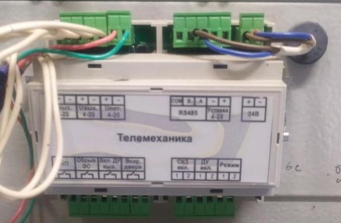
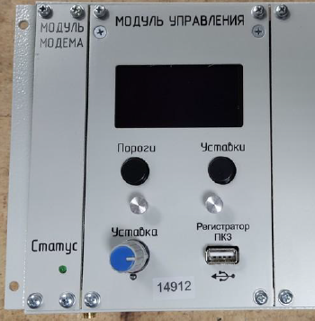

{width=704px height=460px}

## Встроенным GSM модемом.

СКЗ серии ПКЗ-АР-Е2 Могут быть оснащены встроенным GSM модемом. Более широкий модуль модема для блока управления БУ-028, может быть с тумблером или без (с двумя светодиодами) Более широкий модуль модема, может быть с тумблером или без (с двумя светодиодами).

{width=642px height=585px}

## Узкий модуль модема для блока управления БУ-026

Имеет один светодиод, при этом для исполнения с ЖК экраном модуль измерения не устанавливается, вместо него установлена заглушка.

{width=350px height=356px}

## Подключение

Для подключения СКЗ к системам телеметрии через токовую петлю используется штатный блок ввода-вывода

